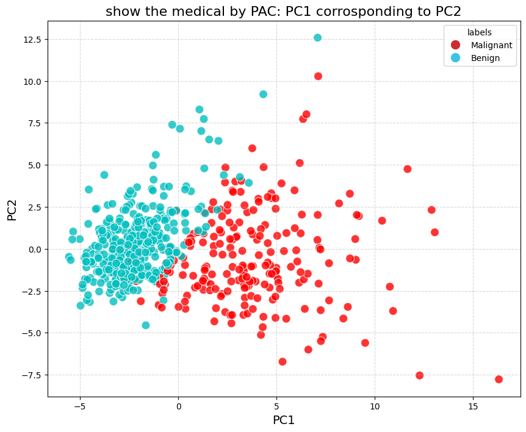
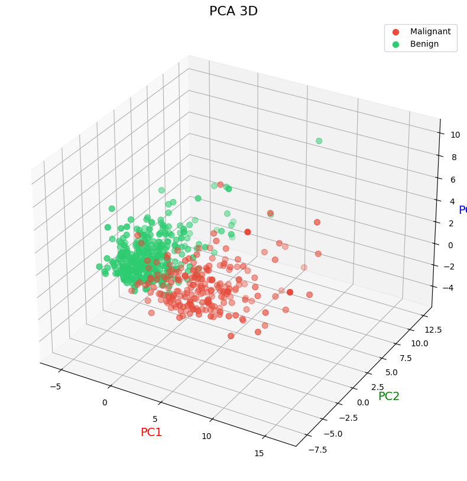

# intractive PCA on Medical Data
undersanting dimensionality reduction and features importance using real medical dataset.
## introduction
This project illustrate how Principle Components Analysis (PCA) reduce the dimensions of real medical dataset (breast cancer) while preserving the most crucial diagnostic information.
It provides an intuitive way to visualize and understand features importance in diseases classifications.
## Datasets and Methods
The dataset used is the *Breast Cancer Wisconsin* dataset from scikit-learn, 
containing 30 numerical features related to tumor cell characteristics.  
We applied PCA to project the high-dimensional data into 2D and 3D spaces 
to explore which combinations of features are best for separating benign and malignant cases.
where:
- 2D captures approximately 60% of infrmation
- 3D captures approximately 70% of infrmation

## Visual Results
Below are sample visualizations from the notebook:

- 2D PCA Projection:
  
- 3D PCA Projection:
  
## Conclusion
PCA effectively reduced the dataset from 30 dimensions to 2–3 while 
retaining most of the diagnostic variance.  
The analysis highlights how dimensionality reduction 
can be valuable tools in medical data analysis and visualization.

